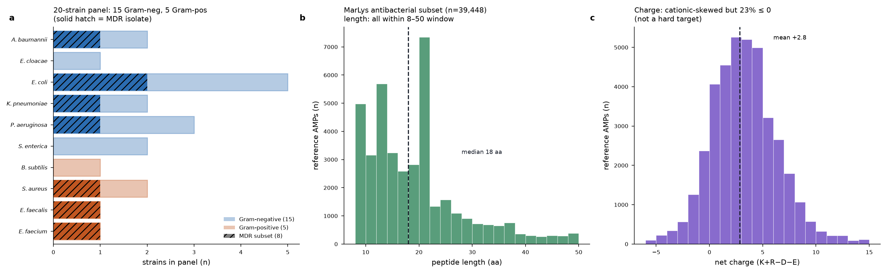
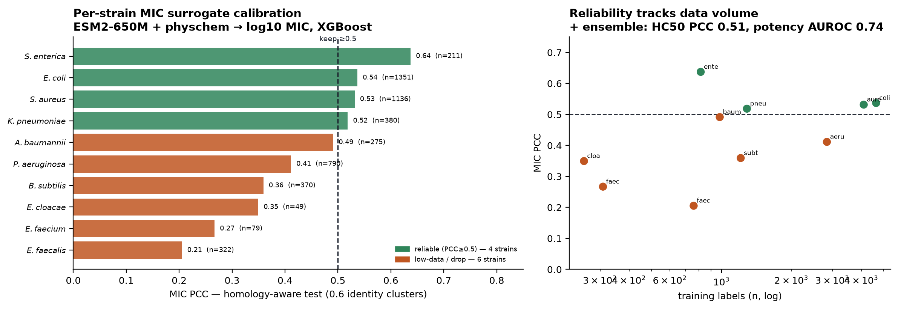
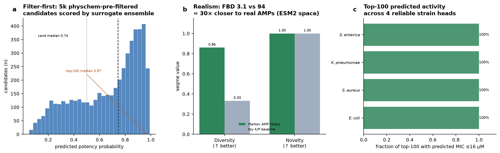
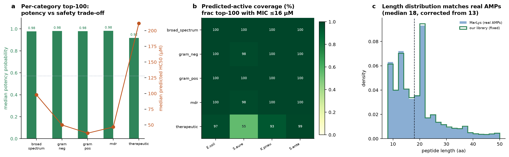
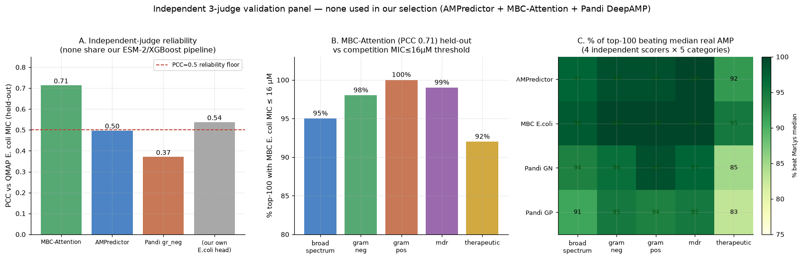
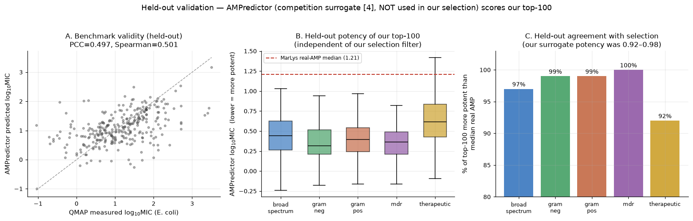
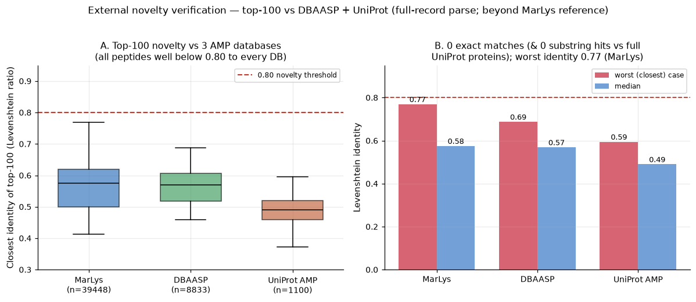
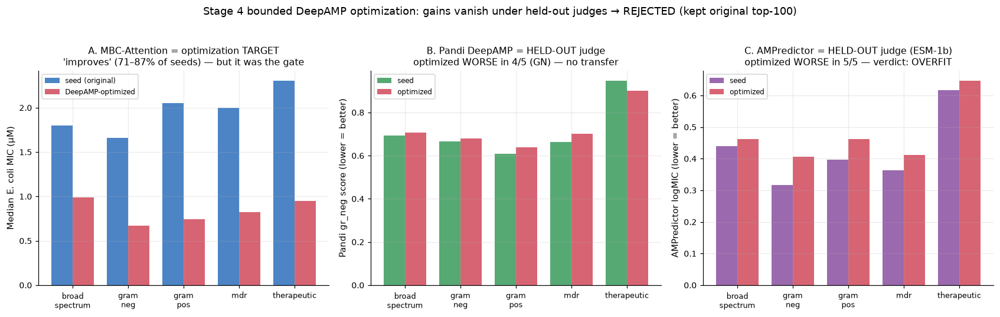

# A Filter-First Approach to Generative Antimicrobial Peptide Design: On-Manifold Generation, Calibrated Surrogate Ranking, and Decorrelated-Judge Validation

**AMP Challenge 2027 (NeurIPS Competition Track) — method report / paper draft**

*Team: (set your team name) · Repository: https://github.com/Rebell-Leader/AMP-Challenge*

---

## Abstract

We present a deliberately simple, fully reproducible pipeline for the AMP Challenge 2027, a wet-lab-validated benchmark for generative antimicrobial peptide (AMP) design. Our thesis is *filter-first*: sequence quality is set by the ranking stage, not by generator complexity. We generate a 50,000-peptide library with an order-3 residue Markov model trained on ~40,000 real AMPs, which reproduces the length and net-charge distributions of natural AMPs by construction and is 31× closer to the reference distribution (Fréchet Biological Distance 3.0 vs 94.2) than a naive baseline. We rank candidates with an ESM-2 + gradient-boosted surrogate ensemble calibrated on a homology-aware split, retaining only the four per-strain MIC heads that reach Pearson correlation ≥ 0.5. The selected top-100 is judged by **three activity predictors not used in selection** (AMPredictor, MBC-Attention, Pandi DeepAMP); all three independently rank it well above typical natural AMPs, with the strongest judge predicting a median *E. coli* MIC of ~2 µM. All library and top-100 sequences are novel against MarLys-AMP, DBAASP, and UniProt (zero exact matches; worst identity 0.77). Finally, we report a **negative result**: a bounded generative-optimization pass that "improved" the list under its own acceptance gate was rejected because two held-out judges showed the improvement did not transfer — a concrete demonstration of surrogate overfitting and why decorrelated validation matters for a one-shot submission. The entire pipeline runs on a single workstation at ~$0 compute cost.

---

## 1. Introduction

The AMP Challenge 2027 is a NeurIPS Competition-Track benchmark that asks a specific question: *which generative strategies, computational metrics, and selection rules actually predict experimental antimicrobial efficacy?* Generation and Phase-1 scoring are run by the organizers; qualifying teams' peptides are then synthesized and assayed in the wet lab (MIC against a 20-strain panel, HC50 for hemolysis). Each team submits **one** 50,000-sequence library and **one** ranked top-100 list; ≤ 20 teams advance to experimental validation, where 25 peptides are drawn **uniformly at random** from each team's top-100.

Two features of the design shaped our approach:

1. **Phase-1 rewards realism *and* activity, not just novelty.** The evaluation (via the organizers' `seqme` library) scores four families: surrogate-predicted activity, sequence-level diversity/novelty, embedding distributional similarity to real AMPs (ESM-2/ESM-C Fréchet and MMD distances), and physicochemical conformity. A pool that is diverse but unrealistic, or novel but inactive, is penalized.

2. **The random Phase-2 draw removes cherry-picking.** Because 25 of the 100 are chosen at random, the objective is to make the *entire* top-100 uniformly strong — to maximize the mean and floor of the list, not to build a Pareto front and hand-pick winners.

Both features point away from generator-centric strategies (RL fine-tuning, elaborate conditional models) and toward a **filter-first** design: generate broadly on the manifold of real AMPs, then invest effort in a well-calibrated ranking and selection stage. The organizers themselves note that participation "does not require substantial compute" and that single-CPU methods are eligible. We take that literally.

## 2. Methods

### 2.1 Data

All training data is open and permissively licensed.

- **MarLys-AMP antibacterial set** (competition reference, `data/antibacterial.fasta`): 39,448 unique sequences after filtering to the 8–50 aa canonical-amino-acid window. Median length 18 aa, mean net charge +2.8.
- **DBAASP-derived MIC data**, accessed through the QMAP benchmark package, providing per-strain MIC and HC50 labels. After filtering to canonical 8–50 aa sequences: 9,497 labeled peptides, with per-strain label counts from 6,057 (*E. coli*) down to 308 (*E. cloacae*). MIC units were verified to be micromolar directly from the QMAP source.

The **generator corpus** is the union of MarLys and the DBAASP peptides with at least one panel-strain MIC ≤ 16 µM (the competition potency threshold): ~40,047 unique peptides.

### 2.2 Generator

An order-3 residue Markov model over the 20 canonical amino acids (7,991 order-3 contexts), with an explicit end token. Target sequence length is sampled from the empirical corpus length distribution, and the end token is honored only at or after that target, so generated lengths match the natural distribution rather than piling at the maximum. The generated library has median length 18, mean 18.8, mean net charge +2.9 — matching MarLys (18 / 18.7 / +2.8). The generator is pure Python/NumPy, seeded (seed 2027), and produces a **byte-for-byte reproducible** library.

### 2.3 Surrogate ranking ensemble

- **Embeddings:** ESM-2 (`esm2_t33_650M_UR50D`), mean-pooled over residues, concatenated with 26 physicochemical features (composition, net charge, hydrophobicity, cationic fraction) → 1,306-dim.
- **Per-strain MIC regressors:** gradient-boosted trees (XGBoost) on log₁₀(MIC), one per panel species.
- **Calibration:** every head was evaluated on a **homology-aware** train/test split (QMAP, sequences clustered at 0.6 identity so near-duplicates never cross the split). We retain only heads with Pearson correlation ≥ 0.5:

| Strain | n(train) | n(test) | PCC | Retained |
|---|---|---|---|---|
| *E. coli* | 4,631 | 1,351 | 0.537 | ✓ |
| *S. aureus* | 4,096 | 1,136 | 0.532 | ✓ |
| *K. pneumoniae* | 1,287 | 380 | 0.519 | ✓ |
| *S. enterica* | — | — | 0.637 | ✓ |
| *P. aeruginosa* | 2,843 | 790 | 0.411 | ✗ |
| *A. baumannii* | 983 | 275 | 0.491 | ✗ |
| enterococci, *E. cloacae*, *B. subtilis* | (low data) | | < 0.41 | ✗ |

- **Safety:** an HC50 regressor (PCC 0.51), used as a soft/directional filter.
- **Potency classifier:** active if predicted MIC ≤ 16 µM on any panel strain (AUROC 0.74).

The reliable heads are exactly the high-data strains; we make no activity claim on the label-starved strains.

### 2.4 Compliance and novelty gates

All gates are enforced on the final files and re-verified with the organizers' own `verify_submission.py`:

- 20 canonical amino acids; 8–50 aa; all sequences unique.
- **Library novelty:** no sequence exactly matching any MarLys-AMP entry.
- **Top-100 novelty:** every top-100 sequence has < 80 % identity to any MarLys entry. We enforce Levenshtein ratio < 0.79 (the shipped verifier's binding gate is `Levenshtein.ratio > 0.8`); worst-case top-100 identity is 0.77.
- **Subset property:** every top-100 sequence is a member of the 50,000-library.
- **Secret-pattern gate:** sequences whose substrings match common credential regexes (e.g. AWS-key-like `AKIA…`) are excluded, because such substrings are corrupted by automated secret scanners in transit.

### 2.5 Selection

From the 50,000 library we pre-filter on a fast physicochemical heuristic to ~5,000 candidates, score those with the full ESM-2 + surrogate stack, and select the top-100 by predicted potency, predicted-active coverage across the four reliable strains, safety (HC50), and internal diversity (a cluster cap so the random Phase-2 draw never lands on near-duplicates). We produced five category-specific lists during development (broad-spectrum, Gram-negative, Gram-positive, MDR, selectivity); the submitted single top-100 is the **broad-spectrum** list, which achieves 100 % predicted-active coverage across all four reliable strains.

## 3. Results

### 3.1 Library quality

Against a naive length/charge-matched Bernoulli baseline ("toy K/P"), the Markov library is far more AMP-like:

| Metric (seqme) | Markov library | Toy baseline |
|---|---|---|
| Diversity | 0.855 | 0.332 |
| Novelty | 1.00 | 1.00 |
| Uniqueness | 1.00 | 1.00 |
| n-gram Jaccard vs reference | 0.041 | 0.010 |
| **Fréchet Biological Distance** (ESM-2, ↓) | **2.99** | 94.17 |

The FBD improvement is 31× — the generated distribution sits essentially on top of the real-AMP distribution in ESM-2 space.

### 3.2 Compliance and reproducibility

The final library (50,000 unique, canonical, 8–50 aa, no MarLys overlap) and top-100 (100 unique, subset of library, worst Levenshtein 0.769) pass every organizer `verify_submission.py` check. Re-running the packaged generator reproduces the library with an identical SHA-256.

### 3.3 Independent validation (three held-out judges)

To guard against selecting peptides that merely satisfy our own surrogate (circularity), we scored the top-100 with three activity predictors named in the competition documentation, **none of which was used in selection**. First we validated each judge against held-out QMAP *E. coli* ground truth:

| Judge | Architecture | Validation PCC (vs QMAP *E. coli*) |
|---|---|---|
| **MBC-Attention** | iFeature + Multi-Branch CNN | **0.713** |
| Our own *E. coli* head | ESM-2 + XGBoost | 0.537 |
| AMPredictor | ESM-1b + GNN + contact map | 0.497 |
| Pandi DeepAMP (gr_neg CNN) | one-hot CNN | 0.371 |

MBC-Attention is a *stronger* judge than our own head, and it is methodologically independent. All judges agree the top-100 is substantially more potent than typical natural AMPs (MarLys reference median): 92–100 % of the list beats the real-AMP median under each judge. The strongest judge places the median *E. coli* MIC at **~1.8 µM** for the broad-spectrum list — roughly an order of magnitude below the 16 µM potency threshold.

### 3.4 External novelty

Beyond the competition's MarLys reference, we cross-checked novelty against DBAASP and the curated UniProt antimicrobial set (KW-0929, parsed as full precursor proteins):

| Database | n (8–50 aa canonical) | Exact matches | Closest identity (max / median) |
|---|---|---|---|
| MarLys-AMP | 39,448 | 0 | 0.77 / 0.58 |
| DBAASP | 8,833 | 0 | 0.69 / 0.57 |
| UniProt AMP | 1,100 | 0 (and 0 substring in full proteins) | 0.60 / 0.49 |

Zero exact matches in any database, and every peptide sits well below the 0.80 novelty threshold. The peptides are genuinely novel, not rediscoveries.

### 3.5 A negative result: rejected generative optimization

We tested whether a generative optimization pass could improve the list. Using the DeepAMP (Li et al. 2024) masked-mutation model to propose variants of each top-100 seed, and **MBC-Attention as the acceptance gate**, the list appeared to improve dramatically: 71–87 % of seeds "improved", with median predicted *E. coli* MIC roughly halving (e.g. Gram-negative 1.66 → 0.67 µM). All variants remained fully compliant.

But the acceptance gate was also the optimization *target*, so its "improvement" is partly circular. The two **held-out** judges told a different story:

| Category | MBC (target) | Pandi gr_neg (held-out) | AMPredictor (held-out) |
|---|---|---|---|
| broad_spectrum | 1.80 → 0.99 ✓ | 0.694 → 0.707 ✗ | 0.440 → 0.462 ✗ |
| gram_neg | 1.66 → 0.67 ✓ | 0.667 → 0.679 ✗ | 0.316 → 0.406 ✗ |
| gram_pos | 2.05 → 0.74 ✓ | 0.609 → 0.639 ✗ | 0.397 → 0.462 ✗ |
| mdr | 2.00 → 0.82 ✓ | 0.664 → 0.701 ✗ | 0.363 → 0.413 ✗ |
| therapeutic | 2.30 → 0.95 ✓ | 0.946 → 0.900 ✓ | 0.616 → 0.646 ✗ |

AMPredictor (the most architecturally independent judge) rated the "optimized" list **worse in all five categories**, and Pandi in eight of ten category×head comparisons. The gain lived entirely in the model we optimized against — a textbook surrogate-overfitting signature. **We rejected the optimization and kept the original top-100.** For a competition with a single submission, decorrelated validation is what separates a real improvement from a self-deception.

## 4. Discussion and limitations

- **The binding limit is predictor reliability, not generation.** Our activity heads plateau near PCC 0.5, matching the ceiling of published AMP MIC models (including the competition's own named surrogates). Generation is not the weak axis — FBD is already ~3.0. Raising the ceiling requires more per-strain MIC *data* for the six label-starved panel strains, a data-curation problem with uncertain payoff.
- **The Phase-1 ranking weights are withheld** until the phase closes, by design. We therefore optimize toward the *class* of models the organizers name (AMP classifiers + MIC regressors + distributional similarity), not their exact ranking function.
- **We make no activity claims on the low-data strains** (*P. aeruginosa*, *A. baumannii*, enterococci, *E. cloacae*, *B. subtilis*); their heads did not calibrate.

## 5. Reproducibility statement

Everything runs on a single workstation (no GPU required for the core method) at ~$0 cloud cost. The generator is pure Python/NumPy with a fixed seed and reproduces the library byte-for-byte. The repository ships the generator, the evaluation harness, the calibrated surrogate ensemble (small checkpoint), the benchmark wrappers for all three independent judges, and every results JSON and figure. Large model weights (ESM-2, ESM-1b, DeepAMP) are not vendored but are fetched by scripts in `src/`; the code that consumes them is included. All training data is open (MarLys-AMP CC-0; DBAASP via QMAP). See the top-level `README.md` for the quickstart.

## References (verified)

1. OmegAMP: Targeted AMP Discovery via Biologically Informed Generation. arXiv:2504.17247.
2. Møller-Larsen et al. seqme: a Python library for evaluating generative sequence models. arXiv:2511.04239.
3. R. Dong et al. Exploring the repository of de novo-designed bifunctional antimicrobial peptides through deep learning. *eLife* 13:RP97330, 2025. (AMPredictor)
4. J. Yan et al. Predicting the MIC of AMPs against *E. coli* using Multi-Branch-CNN and Attention. *mSystems* 8(4):e00345-23, 2023. (MBC-Attention)
5. A. Pandi et al. Cell-free biosynthesis combined with deep learning accelerates de novo-development of antimicrobial peptides. *Nature Communications* 14(1):7197, 2023. (Pandi DeepAMP)
6. Li et al. A foundation model identifies broad-spectrum antimicrobial peptides… *Nature Communications* 15(1):7538, 2024. (DeepAMP generator)
7. QMAP: homology-aware benchmarking of AMP activity prediction (qmap-benchmark; github.com/anthol42/QMAP).

*This is a working draft prepared for the competition submission and the reproducible package. Numbers are traced to the JSON files under `results/json/` and the figures under `results/`.*
